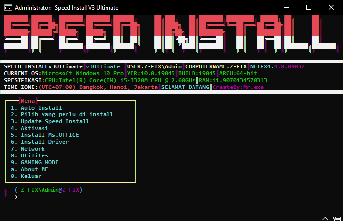

# ꧁𓊈𒆜 ⎛⎝ ≽ > ⩊ < ≼ ⎠⎞ 𝐖𝐄𝐋𝐂𝐎𝐌𝐄 ⎛⎝ ≽ > ⩊ < ≼ ⎠⎞ 𒆜𓊉꧂

## 👾 Tentang Repositori Ini ☣︎
Repositori ini berisi berbagai skrip dan proyek dalam **Batch, Python, C++, JavaScript, HTML, dan PHP** untuk **otomatisasi, pengembangan web, dan pengamanan**. Dengan tambahan kategori **Bug Hunting**, Anda bisa menemukan alat bantu untuk mengidentifikasi dan mengamankan sistem dari potensi kerentanan.

### ☣️𝕎𝔼𝔹𝕊𝕀𝕋𝔼 𝕆𝔽𝔽𝕀ℂ𝕀𝔸𝕃☣️

---

## 🚀 Kelebihan Menggunakan Batch File ⎛⎝( ` ᢍ ´ )⎠⎞ᵐᵘʰᵃʰᵃ
Batch file adalah alat yang kuat dan sederhana yang memungkinkan Anda:
- ✅ Menjalankan perintah sistem tanpa membuka satu-satu
- ✅ Otomatisasi tugas rutin, seperti backup dan cleanup
- ✅ Mempermudah pengaturan dan konfigurasi di berbagai komputer
- ✅ Tidak membutuhkan module yang harus di download
Dengan sedikit kode, Anda bisa menghemat waktu dan usaha!

---

## 📜 Proyek Utama dalam Repositori Ini 🕷🕸️
   ദ്ദി ༎ຶ‿༎ຶ ) ( ͠° ͟ʖ ͡°) (◡̀_◡́) (๑ > ᴗ < ๑) (˶ᵔ ᵕ ᵔ˶) ദ്ദി(ᵔᗜᵔ) (੭˃ᴗ˂)੭ (｡•́︿•̀｡)
### 🦇 Batch File 🦇

╰┈➤ **⚡︎ Speed Installv3 ULTIMATE**  

    
    ███████╗██████╗ ███████╗███████╗██████╗     ██╗███╗   ██╗███████╗████████╗ █████╗ ██╗     ██╗     
    ██╔════╝██╔══██╗██╔════╝██╔════╝██╔══██╗    ██║████╗  ██║██╔════╝╚══██╔══╝██╔══██╗██║     ██║     
    ███████╗██████╔╝█████╗  █████╗  ██║  ██║    ██║██╔██╗ ██║███████╗   ██║   ███████║██║     ██║     
    ╚════██║██╔═══╝ ██╔══╝  ██╔══╝  ██║  ██║    ██║██║╚██╗██║╚════██║   ██║   ██╔══██║██║     ██║     
    ███████║██║     ███████╗███████╗██████╔╝    ██║██║ ╚████║███████║   ██║   ██║  ██║███████╗███████╗
    ╚══════╝╚═╝     ╚══════╝╚══════╝╚═════╝     ╚═╝╚═╝  ╚═══╝╚══════╝   ╚═╝   ╚═╝  ╚═╝╚══════╝╚══════╝
    
   `Speed Installv3Ultimate.exe` - Script yang sudah saya kembangkan dari sejak 2020 untuk versi pertamanya dan sudah berjalan sampai sekarang untuk versi ke tiganya, cocok banget bagi kaum teknisi Laptop atau Komputer yang kerjanya memperbaiki pada bagian software di OS Windows yang support dari Windows 7 sampai 11.

╰┈➤ **⚡︎ Lock Folder**  
   `Lock.bat` - Mengunci serta bisa juga menyembunyikan folder dengan password yang diinginkan, cocok banget buat kamu yang ingin menjaga privasi.

╰┈➤ **⚡︎ Byner Calculator**  
   `byner.bat` - Script yang membantu menyelesaikan masalah konversi bilangan pada biner.

---

## 👾 About This Repository ☣︎  
This repository contains various scripts and projects in **Batch, Python, C++, JavaScript, HTML, and PHP** for **automation, web development, and security**. Additionally, there is a **Bug Hunting** category where you can find tools to identify and secure systems from potential vulnerabilities.

### ☣️𝕎𝔼𝔹𝕊𝕀𝕋𝔼 𝕆𝔽𝔽𝕀ℂ𝕀𝔸𝕃☣️

---

## 🚀 Advantages of Using Batch Files ⎛⎝( ` ᢍ ´ )⎠⎞ᵐᵘʰᵃʰᵃ  
Batch files are powerful and simple tools that allow you to:
- ✅ Run system commands without opening them individually
- ✅ Automate routine tasks like backups and cleanup
- ✅ Simplify setups and configurations across multiple computers
- ✅ No need to download external modules
With just a little code, you can save time and effort!

---

## 📜 Main Projects in This Repository 🕷🕸️  
   ( ͠° ͟ʖ ͡°) (◡̀_◡́) (๑ > ᴗ < ๑) (˶ᵔ ᵕ ᵔ˶) (ᵔᗜᵔ) (੭˃ᴗ˂)੭ (｡•́︿•̀｡)

### 🦇 Batch Files 🦇  

╰┈➤ **⚡︎ Speed Installv3 ULTIMATE**  
`Speed Installv3Ultimate.exe` - A script I developed back in 2020, now in its third version. It is perfect for IT technicians who work with software repairs on Windows OS, supporting versions from Windows 7 to Windows 11.

╰┈➤ **⚡︎ Lock Folder**  
`Lock.bat` - This script allows you to lock and hide a folder with a password of your choice. It's ideal for anyone looking to protect their privacy.

╰┈➤ **⚡︎ Byner Calculator**  
`byner.bat` - A script that helps with binary number conversion.

---  
## Traktir Kopi

Jika Anda merasa terbantu dan ingin memberikan dukungan, Anda bisa traktir kopi melalui link Saweria berikut:

[Traktir Kopi Saya](https://saweria.co/andrewsianturi)

[Traktir Kopi Saya](https://saweria.co/speedinstall)

Terima kasih atas dukungan Anda! ☕
