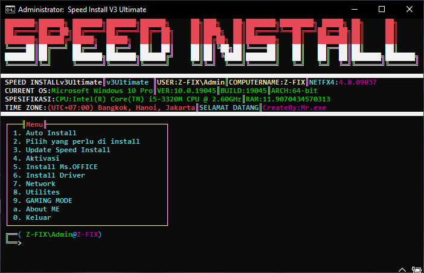

# ꧁𓊈𒆜 ⎛⎝ ≽ > ⩊ < ≼ ⎠⎞ 𝐖𝐄𝐋𝐂𝐎𝐌𝐄 ⎛⎝ ≽ > ⩊ < ≼ ⎠⎞ 𒆜𓊉꧂

  

&nbsp;

## 👾  ☣︎
Repositori ini berisi berbagai skrip dan proyek dalam **Batch, Python, C++, JavaScript, HTML, dan PHP** untuk **otomatisasi, pengembangan web, dan pengamanan**. Dengan tambahan kategori **Bug Hunting**, Anda bisa menemukan alat bantu untuk mengidentifikasi dan mengamankan sistem dari potensi kerentanan.

### ☣️𝕎𝔼𝔹𝕊𝕀𝕋𝔼 𝕆𝔽𝔽𝕀ℂ𝕀𝔸𝕃☣️

---

## 📜 Proyek Utama dalam Repositori Ini 🕷🕸️
   ദ്ദി ༎ຶ‿༎ຶ ) ( ͠° ͟ʖ ͡°) (◡̀_◡́) (๑ > ᴗ < ๑) (˶ᵔ ᵕ ᵔ˶) ദ്ദി(ᵔᗜᵔ) (੭˃ᴗ˂)੭ (｡•́︿•̀｡)
### 🦇 Batch File 🦇

╰┈➤ **⚡︎ Speed Installv3 ULTIMATE**  

    
    ███████╗██████╗ ███████╗███████╗██████╗     ██╗███╗   ██╗███████╗████████╗ █████╗ ██╗     ██╗     
    ██╔════╝██╔══██╗██╔════╝██╔════╝██╔══██╗    ██║████╗  ██║██╔════╝╚══██╔══╝██╔══██╗██║     ██║     
    ███████╗██████╔╝█████╗  █████╗  ██║  ██║    ██║██╔██╗ ██║███████╗   ██║   ███████║██║     ██║     
    ╚════██║██╔═══╝ ██╔══╝  ██╔══╝  ██║  ██║    ██║██║╚██╗██║╚════██║   ██║   ██╔══██║██║     ██║     
    ███████║██║     ███████╗███████╗██████╔╝    ██║██║ ╚████║███████║   ██║   ██║  ██║███████╗███████╗
    ╚══════╝╚═╝     ╚══════╝╚══════╝╚═════╝     ╚═╝╚═╝  ╚═══╝╚══════╝   ╚═╝   ╚═╝  ╚═╝╚══════╝╚══════╝
    
   `Speed Installv3Ultimate.exe` - Script yang sudah saya kembangkan dari sejak 2020 untuk versi pertamanya dan sudah berjalan sampai sekarang untuk versi ke tiganya, cocok banget bagi kaum teknisi Laptop atau Komputer yang kerjanya memperbaiki pada bagian software di OS Windows yang support dari Windows 7 sampai 11.

---

## 🚀 Advantages of Using Batch Files ⎛⎝( ` ᢍ ´ )⎠⎞ᵐᵘʰᵃʰᵃ  
Batch files are powerful and simple tools that allow you to:
- ✅ Run system commands without opening them individually
- ✅ Automate routine tasks like backups and cleanup
- ✅ Simplify setups and configurations across multiple computers
- ✅ No need to download external modules
With just a little code, you can save time and effort!

---  

## Traktir Kopi

Jika Anda merasa terbantu dan ingin memberikan dukungan, Anda bisa traktir kopi melalui link Saweria berikut:

[Traktir Kopi Saya](https://saweria.co/andrewsianturi)

[Traktir Kopi Saya](https://saweria.co/speedinstall)

Terima kasih atas dukungan Anda! ☕
